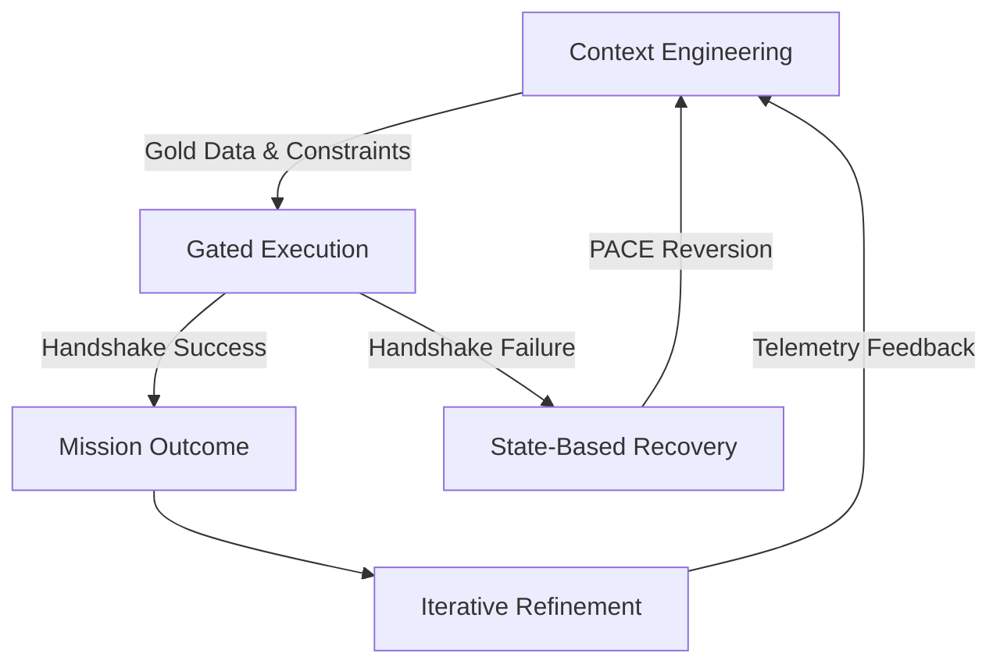

# Deterministic AI Orchestration Framework

This repository implements structural integrity across the spectrum of machine intelligence. Whether deploying autonomous agents or optimizing human-in-the-loop workflows, we treat AI as a high-compute, low-intuition asset requiring a rigorous governor.

---

### **I. Context Engineering (The Boundary)**
**Intent:** Secure the operational environment by defining logical and physical edges before execution. We anchor the system in gold data, the immutable truth, to eliminate assumptions in latent space.

* **For Autonomous Agents:** Hard-code environmental constraints and supply high-fidelity reference patterns for novel or complex logic.
* **For Chatbot Users:** Front-load prompts with immutable specifications, and negative constraints to prevent hallucinations outside the required scope.
* **Physical Constraint Modeling:** Context must account for hardware failure states, and degraded sensor telemetry.
* **The Outcome:** Uncertainty is engineered out. The system operates within a pre-validated environment of safety.

---

### **II. Gated Execution (The Handshake)**
**Intent:** Validate every state transition through a deterministic audit. We transform raw AI telemetry into verified system data.

* **For Autonomous Agents:** Deploy secondary auditor agents, or validation schemas to verify output against a strict interface control document.
* **For Chatbot Users:** Execute a verification step where output is validated against the original objective before adoption.
* **The Outcome:** Failure is contained at the gate. Hallucinations are trapped before they impact hardware, or business processes.

---

### **III. Iterative Refinement (The Optimization)**
**Intent:** Treat architecture as a dynamic feedback loop. Telemetry is used to continuously tighten the governor.

* **For Autonomous Agents:** Use validation failures to automatically update reference patterns, and system constraints.
* **For Chatbot Users:** Apply reinforcement learning from human feedback principles by refining the base instructions based on the errors of the previous turn.
* **The Outcome:** The architecture grows more resilient with every execution. We optimize the system, not just the individual answer.

---

### **IV. State-Based Recovery (The Resilience)**
**Intent:** Replace retries with deterministic fallback paths.

* **For Autonomous Agents:** Trigger the alternate path, such as reverting to the last known-good state, immediately upon gate failure.
* **For Chatbot Users:** Establish a contingency template to ensure the operator can reset to a clean state without losing momentum.
* **The Outcome:** Mission continuity is maintained regardless of individual agent drift. Reliability is an architectural feature.

---

### **V. The Systems Thinking Shift (The Inevitability)**
**Intent:** Transition from asking to commanding. We treat AI as a brilliant but context-blind junior engineer. This asset possesses high theoretical knowledge, but no field experience.

* **The Mindset:** Success requires a lead engineer who provides enough instruction to let the junior engineer succeed. We eliminate the uncertainty factor by issuing clear, sequential directives.
* **The Result:** By removing ambiguity, we transform stochastic tools into deterministic systems we can trust.

---

### **The Economic Reality**
Most teams treat AI as a source of chance, and suffer the chaos of poor orchestration. We utilize it as a compiler for intent. We do not seek to be impressive. We seek to be inevitable.

* **Zero-Fail Doctrine:** Engineered for defense, aerospace, and founder-operators where inefficiency is a fatal risk.

#### **Author:** Charles Austin II | Principal AI Systems and Solutions Architect | 2026
