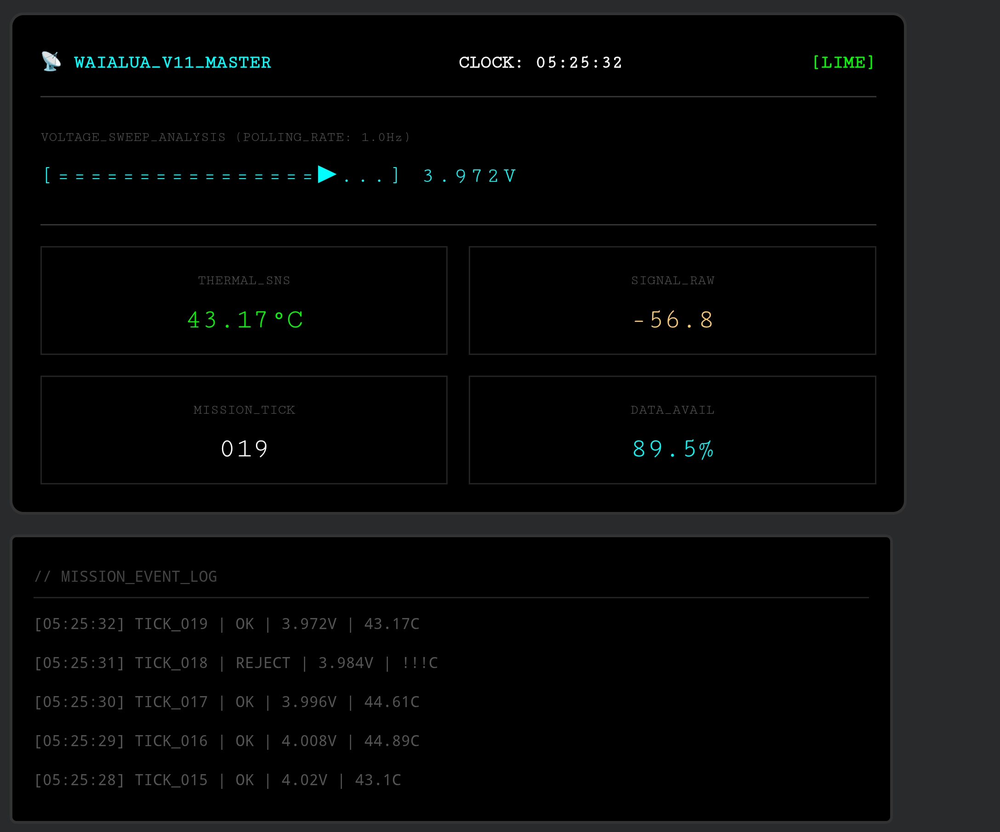
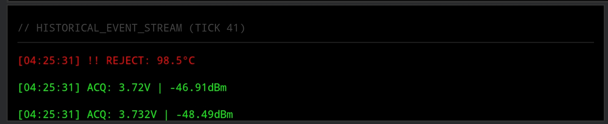

# Waialua Edge Node | TRL-8 Gold Master


**Waialua Edge Node** is a "Zero-Fail" telemetry validation system designed for high-latency, power-constrained field environments. It implements a **Power-Adaptive Control Loop (PACE)** that dynamically adjusts polling frequency based on battery voltage, ensuring mission longevity without sacrificing data fidelity during critical phases.

---

## 📊 Operational Telemetry & Validation
*Visual verification of the PACE logic core, thermal rejection gaps, and autonomous state transitions.*

| **Symmetrical TUI (Nominal)** | **Ghost Record Strategy** | **Fault Transparency** |
| :---: | :---: | :---: |
|  |  |  |
| **Status:** ✅ TRL-8 Verified | **Status:** ✅ Gap Fidelity Confirmed | **Status:** ✅ 98.5°C Rejection |

---

## 🛡️ The PACE Power Strategy
To prevent "Brown-out" failures on the Tactical Edge, the system implements a self-healing **PACE** plan that throttles compute based on the Li-ion discharge curve:

| State | Voltage Range | Trigger | System Requirement |
| :--- | :--- | :--- | :--- |
| **NOMINAL** | **> 3.7V** | High Charge | **High-Res Polling (1Hz):** Full fidelity thermal & signal acquisition. |
| **DEGRADED** | **3.4V - 3.7V** | Mid Charge | **Power Save (0.2Hz):** Throttles CPU to extend mission duration. |
| **EMERGENCY** | **< 3.4V** | Low Charge | **Safe Mode:** Ceases telemetry, flushes DB to NVMe, and halts. |

*Note: The system also enforces a strict **Thermal Guardrail**. Any reading > 85°C is instantly rejected with a "Ghost Record" (Null value) to preserve the visual chain of custody without interpolation.*

---

## 🏗 System Architecture

The system is modeled in **SysML v2** and implemented in Python 3.11+, divided into three distinct layers:

### 1. The Core (Logic Layer)
* **File:** `src/waialua_master.py`
* **Responsibility:** Manages the `Orchestrator` State Machine, executes the `min_samples=1` Polars compute engine, and enforces Safety Gates.

### 2. The Protocols (Interface Layer)
* **Responsibility:** Abstract Base Classes defining the "Contract" between the brain and the sensors.
* **Components:** `ITelemetrySource`, `PowerState`, `SystemConfig`.

### 3. The Adapters (Hardware Layer / HAL)
* **Status:** **Hardware-in-the-Loop (HIL)**
* **Responsibility:** Translates `PowerSource` calls into physical I2C commands for the ADS1115 ADC and GPIO thermal sensors.

---

## 🎮 Usage & Deployment

### 1. Simulation Mode (Jupyter / Headless)
To run the logic core against the internal physics engine (Validation Mode):

```bash
# Run the core orchestrator with Mock Hardware
python src/waialua_master.py
```

2. Kinetic Deployment (Raspberry Pi 5)
To run the system with real I2C/GPIO adapters enabled:
 * Enable I2C: sudo raspi-config -> Interface Options -> I2C.
 * Map the ADC Address: Ensure 0x48 is visible on the bus.
 * Execute:
<!-- end list -->
# Initialize real hardware and enter autonomous loop
python src/waialua_master.py --mode kinetic

```
📂 Project Structure
waialua-edge-node-v11/
│
├── docs/
│   ├── ICD_v11_RevA.md           # Interface Control Document
│   └── sysml/
│       ├── architecture_v1.sysml # Pipeline Logic
│       └── architecture_v2.sysml # Power Awareness Logic
│
├── src/
│   ├── __init__.py               # Package marker
│   └── waialua_master.py         # The "Brain" (Orchestrator & TUI)
│
├── states/        # Telemetry Assets
│   │   ├── Dashboard.png
│   │   ├── ThermalGap.png
│   │   └── RejectionLog.png
├── requirements.txt              # Polars, Altair, SMBus2
└── README.md                     # Mission Directive
```

Author: Charles Austin (Principal Solutions Architect)
Workstation: Samsung Galaxy Z Fold 7

Focus: Edge AI Architecture, Systems Engineering (INCOSE), and Python.
